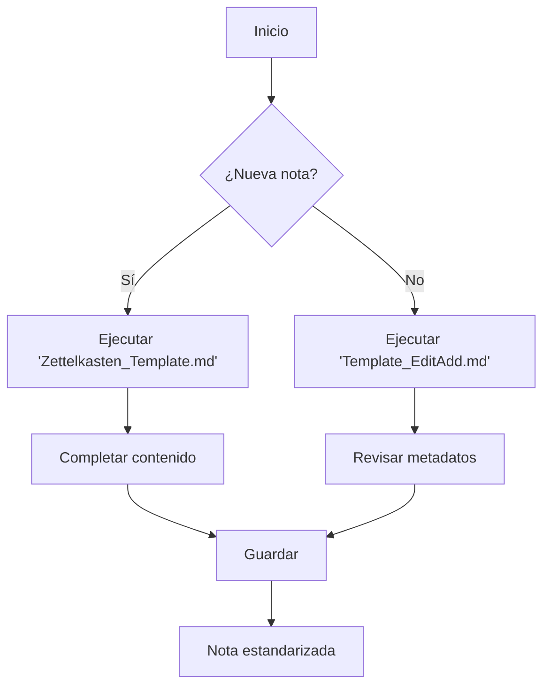

# Plantillas para Obsidian con Templater

Este repositorio contiene plantillas avanzadas para Obsidian que aprovechan el poder del plugin Templater para automatizar la creación y gestión de notas con metadatos estructurados siguiendo la metodologia Zettelkasten, donde se le coloca un id unico a cada nota y se enlaza a las demas a traves de las ideas, siendo obsidian un software perfecto paro esto.

## Características principales

- 🚀 **Creación rápida de notas** con metadatos completos
- ⏱️ **Sistema de timestamp automático** para nombres de archivo únicos
- 🏷️ **Gestión automática de tags y aliases**
- 📁 **Organización consistente** de notas
- 🔄 **Procesamiento de notas existentes** para estandarización

## Plantillas incluidas

### 1. Nueva Nota Atómica (`Zettelkasten_Template.md`)
Crea notas nuevas con estructura predefinida y metadatos automáticos.

### 2. Procesar Nota Existente (`Template_EditAdd.md`)
Estandariza notas existentes añadiendo metadatos y aplicando formato consistente.

## Instalación y uso

### Requisitos previos
- [Obsidian](https://obsidian.md) instalado
- Plugin [Templater](https://github.com/SilentVoid13/Templater) instalado y activado

### Pasos de instalación
1. Clona este repositorio en tu vault de Obsidian:
   ```bash
   git clone https://github.com/glimp-ly/Obsidian-y-Zettelkasten.git "Plantillas"
   ```
2. Configura Templater:
   - Abre Configuración de Obsidian → Comunity Pluggins → Templater
   - Establece la carpeta de plantillas a `Plantillas`
3. Para crear una nueva nota:
   - `Ctrl/Cmd + P` → "Templater: Nueva nota desde plantilla" → Selecciona "Nueva-Nota"
4. Para procesar una nota existente:
   - Abre la nota → `Ctrl/Cmd + P` → "Templater: Abrir plantilla" → Selecciona "Procesar-Nota"
     
Opcional: Puedes añadir hotkeys para agilizar el proceso
## Flujo de trabajo recomendado



## Beneficios

- ✅ **Consistencia**: Todas las notas siguen la misma estructura
- 🔍 **Descubribilidad**: Metadatos completos mejoran la búsqueda
- ⏱️ **Eficiencia**: Ahorra tiempo en creación y organización
- 📈 **Escalabilidad**: Ideal para vaults grandes con miles de notas
- 🔄 **Portabilidad**: Sistema independiente de la plataforma

## Personalización

Puedes modificar las plantillas fácilmente:

1. **Cambiar campos de frontmatter**:
   ```javascript
   // En Nueva-Nota.md
   const content = `---
   id: ${timestamp}
   tipo: "concepto"  // <- Añade nuevos campos
   ...
   `;
   ```

2. **Modificar estructura de contenido**:
   ```javascript
   const content = `...
   ## Nuevo Encabezado:  // <- Cambia secciones
   (Plantilla personalizada)
   `;
   ```

3. **Ajustar formato de tags**:
   ```javascript
   // Convertir a formato #hashtag
   const safeTag = "#" + sanitizedTitle.toLowerCase();
   ```

## Contribuciones

¡Las contribuciones son bienvenidas! Por favor:

1. Haz fork del repositorio
2. Crea una rama (`git checkout -b mejora/plantilla`)
3. Realiza tus modificaciones
4. Envía un Pull Request

## Licencia

Este proyecto está bajo licencia [MIT](LICENSE).

---

✨ **Optimiza tu flujo de conocimiento con estas plantillas** ✨  
💡 **Ideas → Notas estructuradas → Conocimiento accionable** 💡
